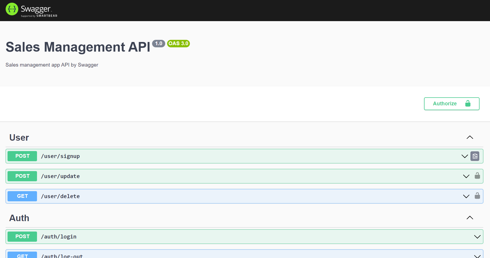
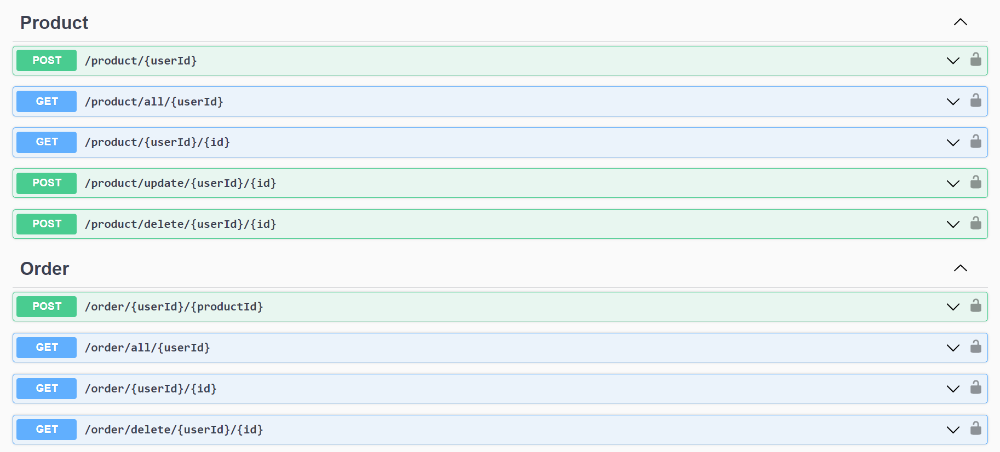
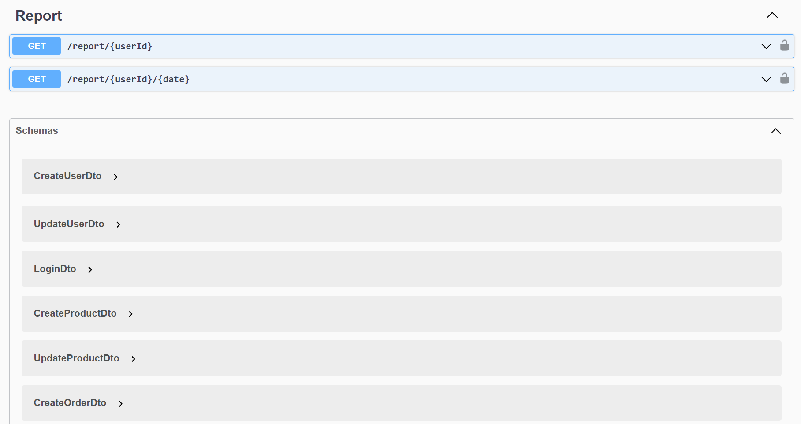

# Sales Management API

## About The Project

APIs to manage User, Product, Order and Generate Sales Report

### Built With

This project is build with following languages and framework

- [Nodejs](https://nodejs.org/en/)
- [Nestjs](https://www.npmjs.com/package/nestjs)
- [TypeORM](https://www.npmjs.com/package/typeorm)
- [Passport](https://www.npmjs.com/package/passport)
- [Jest](https://www.npmjs.com/package/jest)
- [PostGreSQL](https://www.postgresql.org/)

<!-- GETTING STARTED -->

## Getting Started

This is an example of how you may give instructions on setting up your project locally.
To get a local copy up and running follow these simple example steps.

### Prerequisites

- Text editor (Vscode, Sublime text, Notepad++ or any)
- Nestjs Cli `npm install -g @nestjs/cli`

### Installation

1. Clone the repository

2. Open a terminal, navigate to Root directory .

```sh
   cd backend-assignment
```

3. Build npm dependencies

```sh
   npm i
```

1. Create .env Environment Variable file in root directory and paste

```sh
# PostgreSQL DB (Local Connection)
DATABASE_NAME=
DATABASE_HOST=
DATABASE_PORT=
DATABASE_USERNAME=
DATABASE_PASSWORD=

# JWT
JWT_KEY=
JWT_EXPIRE=
```

4. Run as developer

```sh
   npm run start:dev
```

## Working

This is what should look like when you visit `http://localhost:3000`

- ### Dashboard
  
- ### Send Request to add Product and Orders
   
- ### DTOs for data input
   
